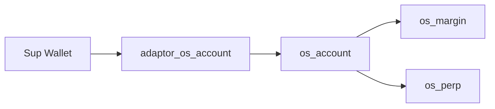

# adaptor_os_account Architecture / Sup 到 os_account 轉接器架構

**Status**: P1 implemented. Tests: 2/2.  
**Package**: `adaptor_os_account`  
**Purpose**: Official Sup Wallet adapter that creates `OsAccount` objects and moves assets between Sup custody and `os_account` custody.

## 0. 中文摘要 / Chinese Summary

`adaptor_os_account` 是 Sup Wallet 到 `os_account` 的官方轉接器。它只處理建立帳戶、從 Sup 存入、從 `os_account` 提回 Sup，以及父錢包身份檢查；真正的 margin/perp 交易不走這個 adapter。

English: `adaptor_os_account` bridges Sup Wallet custody into `os_account`. It is intentionally not part of the trading hot path.

---

## 1. Role / 定位

This adapter is the bridge between Sup Wallet and the unified margin account. It is intentionally small:

- It lets a Sup wallet create an `OsAccount`.
- It lets Sup deposit coins into that account.
- It lets Sup withdraw coins from that account.
- It verifies that a target `OsAccount` belongs to the Sup wallet identity.

Trading operations do not go through this package. Once funds are deposited, `os_margin` and `os_perp` are called directly against `OsAccount`.

---

## 2. Module Map / 模組

| Module | Responsibility |
|---|---|
| `adaptor.move` | `OsAccountAdaptor` service witness, create/deposit/withdraw bridge, parent assertion. |

---

## 3. Trust Boundary / 信任邊界

The adapter is a Sup official service package. It relies on Sup Wallet's intent and request model before it receives authority to move Sup-owned funds. It then calls `os_account` APIs with the Sup wallet identity as parent.

---

## 4. Main Type / 主要型別

### `OsAccountAdaptor`

Drop-only service witness used to identify this official adapter in Sup flows.

### Error

| Error | Meaning |
|---|---|
| `EWrongParent` | The supplied `OsAccount` does not have the same `parent_wallet_identity` as the Sup wallet. |

---

## 5. Public API Surface / 公開 API

| Function | Purpose |
|---|---|
| `create_os_account<T>` | Create an `OsAccount` from a Sup wallet context. |
| `deposit<T>` | Move a `Coin<T>` from Sup flow into an `OsAccount`. |
| `withdraw<T>` | Withdraw a `Coin<T>` from an `OsAccount` back to the Sup flow. |
| `assert_parent` | Verify Sup wallet identity equals `os_account.parent_wallet_identity`. |
| `wrong_parent_error` | Test helper exposing the abort code. |

---

## 6. Flow / 流程

### Create

1. Sup Wallet authorizes adapter execution.
2. Adapter derives the Sup wallet identity.
3. Adapter creates `OsAccount` with that identity as `parent_wallet_identity`.
4. New account is returned/shared according to the entry PTB shape.

### Deposit

1. Sup Wallet authorizes coin movement.
2. Adapter asserts the account parent.
3. Adapter deposits the coin into `os_account` custody.
4. Trading engines can now use that balance through product-scoped calls.

### Withdraw

1. Sup Wallet authorizes withdrawal intent.
2. Adapter asserts the account parent.
3. Adapter asks `os_account` to withdraw the requested coin amount.
4. Coin returns to the Sup-controlled transaction flow.

---

## 7. Invariants / 不變量

- Adapter must never create or withdraw for an account whose parent identity does not match the Sup wallet.
- Adapter does not manage trading positions, market risk, or order state.
- Sup delegate budget limits apply only to Sup-controlled value movement. They are not a substitute for `os_account` trading permission bits.
- Account permission bits still matter after deposit, because later trading calls bypass Sup.

---

## 8. Integration Notes / 整合注意事項

- Keep this package under `Sup_Contract/official/` because it is a canonical service adapter, not a community extension.
- Off-chain Sup UI should display the created `OsAccount` ID as a separate trading account under the Sup wallet.
- Future adapters for other account systems should call `os_account` directly and should not depend on Sup types.
